# **Lab Report**

In this lab report I will provide a tutorial on downloading VScode, ssh-ing into a remote computer with an account, copying files into the remote computer with scp, setting up ssh keys for the client and server, and introducing various commands and tricks about using those commands efficiently.

## *Installing VScode*

Go [here](https://code.visualstudio.com) for the download.  Be sure to choose the version for your os, then open the setup once it is installed.

Accept the agreement that shows up, and either allow the program to go into the directoy it shows for default or put it where you want it.

Do not change any of the additional tasks unless you want a desktop shortcut, in which case check the "Create a desktop icon" box.

Install the program and click finish.

you should be looking at a VScode window like this:

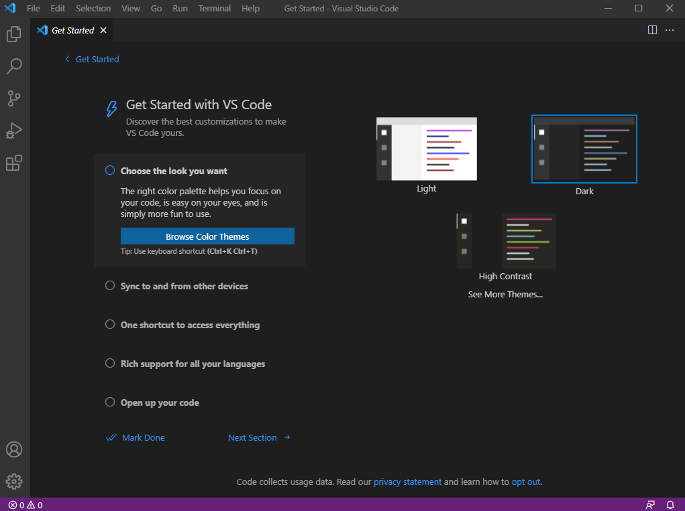

## *Remotely Connecting*

To connect from your computer to a remote computer/server, you will need to be able to run ssh.  If you are on Windows, you will have to enable openssh by going to Settings > Apps > optional features > open ssh client and install it.

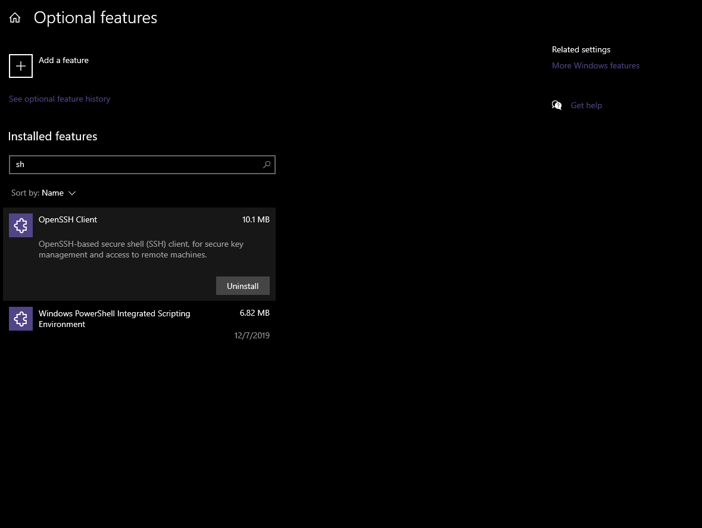

Now you can run ssh from either a terminal in VScode or the commandLine.  For the purposes of this guide we will use a terminal in VScode, so in VScode, click terminal > new terminal.  In your terminal you will type 

```
ssh accountName@remoteCPU
```

you will get a warning message about the authenticity of the host.  If you trust the host, type yes and enter.  You will then be prompted for your password.  While typing in your password, characters will not appear on screan.  

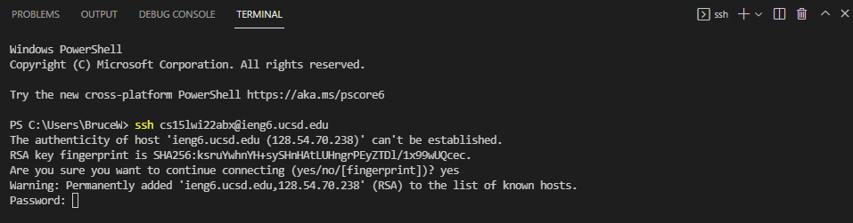

Press enter when your password is in and you will have connected to the remote computer, and your terminal will show that the directory commands are being run from is the remote computer's directory.


## *Trying Some Commands*

Now that you are remotely connected, you can run terminal commands like:

```
ls -lat
cd
cat fileName
```


```ls -lat``` will show you all the files in your current directory with information next to each file like their size and last time updated, and it will sort them from most recently updated to least recently updated.

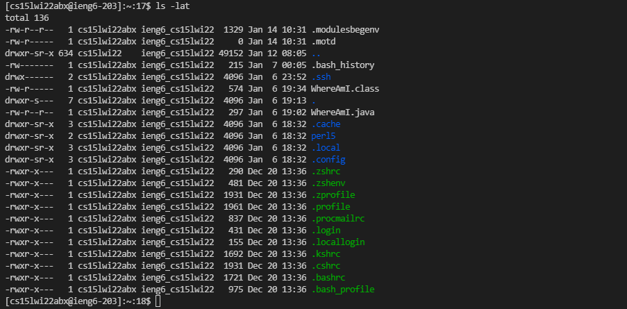

```cd``` allows you to change your current directory to something else you specify, but without an argument it will change you to the home directory, which should be where you already are in your server.

```cat fileName``` allows you to print the contents of a file in the directory you are in.  You can use one of the names from the ls command you used for the cat command.

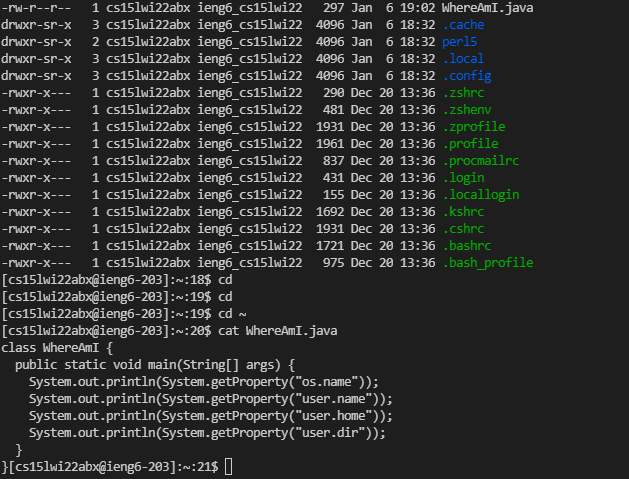

## *Moving Files with scp*

to do work on a remote computer you will certainly need to be able to send files from your local device to the remote one.  We can move files this way with 

```
scp fileName accountName@remoteCPU:directoryToSendTo 
```

First we need to ```logout``` of the ssh by typing logout into the terminal and pressing enter. 

Next we will make a file to send to the server.  In VScode, click File>New file.  You can type something onto this file and save it as a .txt.

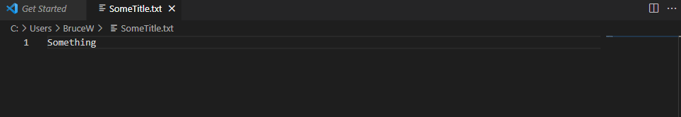

Now that we have a file to put into the server, we can do scp with the file's directory and the server's directory you want the file to go into.  You can get the file directory by right clicking its tab at the top bar on VScode and choosing copy path.  You should then input the account+server details from before, but this time with a directory after a colon, which will put the file in the server's home directory

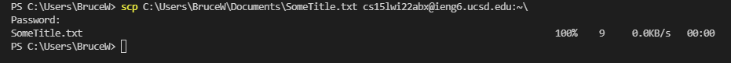

you can also see the file printed by ssh-ing back in and using cat on it

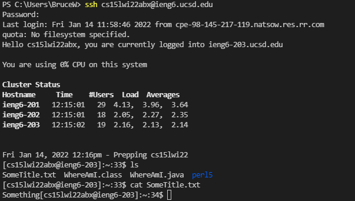

## *Setting an SSH Key*

You may have noticed that we are wasting too much time by entering our password to the server, so we will add a key that automatically logs our device into ssh via the ssh or scp command without a password.  

The first step to the keys is to generate them.  Do this by typing into the terminal 

```
ssh-keygen
```  

First you will be asked where to save the key; press enter to change nothing and leave it in its default place.  Then you will be prompted to come up with a password, just press enter and then enter again because we do not want to have to type a password in.  You now have a pair of keys, one public and one private.

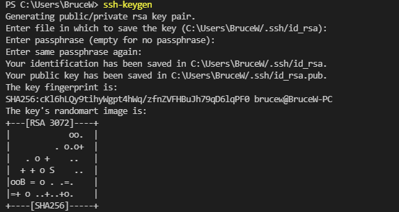

You now need to scp the public key into your server, so copy the directory of your public key, and send it to your server's authorized keys file (not home directory) using scp.  that command should look like this: 

```
scp directoryToPublicKey accountName@remoteCPU:~/.ssh/authorized_keys
```
You will be prompted for the password one last time to send the file. 

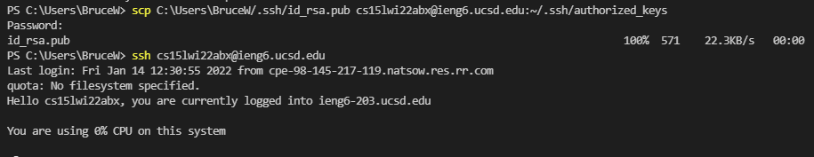

As seen above, you should now be able to log into your ssh without entering a password.

## *Optimizing Remote Running*

The final bit of this tutorial will be about streamlining ssh usage.  One big help is knowing that you can give ssh a third argument and it will run the third argument on the command line after ssh-ing then log out.  Combine that with using semicolons to run multiple commands in one line and you can, for example, login to ssh, compile and run a java program, and log back out in a single command on the line.

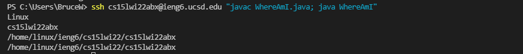

Writing and running this command (with my account name) takes 76 keystrokes whereas running one command at a time: 

```
ssh cs15lwi22abx@ieng6.ucsd.edu
javac WhereAmI.java
java WhereAmI
logout
```

nets 80 keystrokes.  There is another major downside to running these commands one per line though and that is re-running them with the up arrow key.  Re-running the single-line command takes 3 keystrokes, one to click on the terminal for reactivation, one to press the up arrow to bring it back, and one to press execute (Enter).  When re-running all four of these commands separately, Enter needs to be pressed 3 additional times, and because each command is furthur up the history, more up presses than 1 per command are required.  In fact, after activating the terminal, the separate commands take 5 keystrokes each, resulting in 1 terminal activating keystroke, 4 * 4 up arrow keystrokes to bring up commands, and 4 * 1 execute keystorke to execute commands that are brought up.  The 1-line command's 3 keystrokes save 18 keystrokes over the other method's 21 total keystrokes per re-run.

That will conclude the tutorial, hopefully it was helpful, and thank you for reading.
