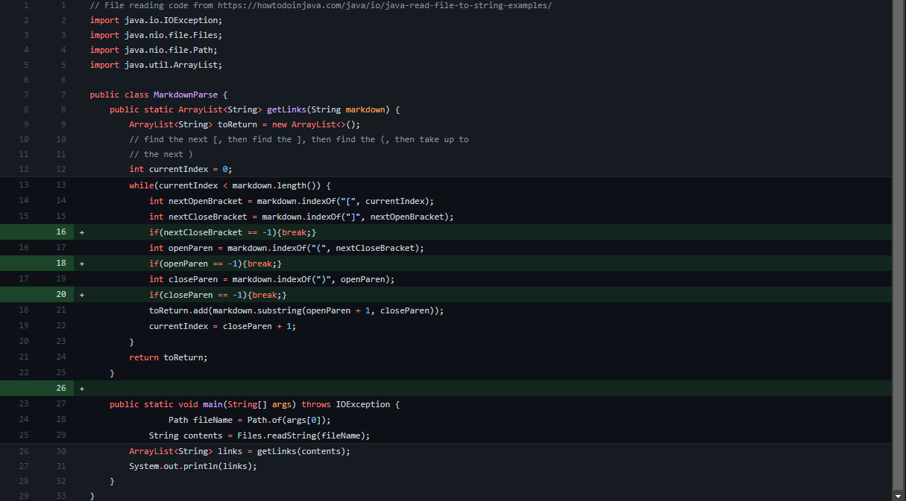
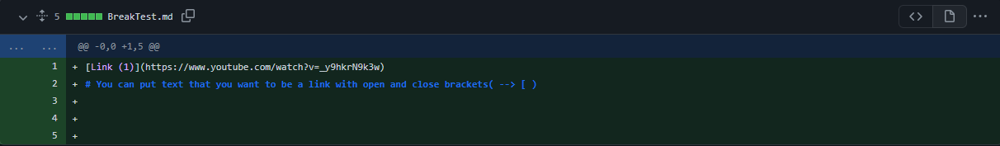
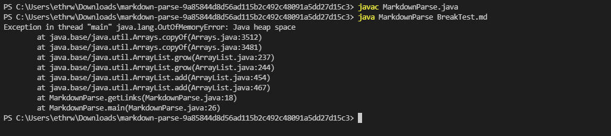
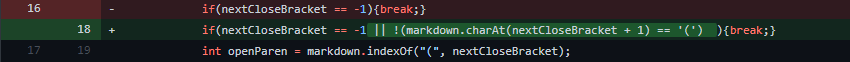
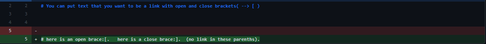
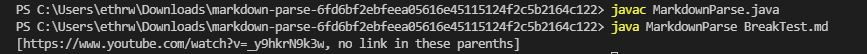
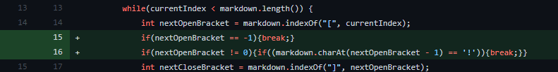
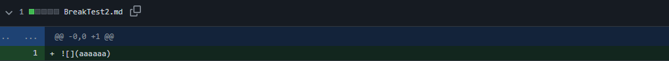
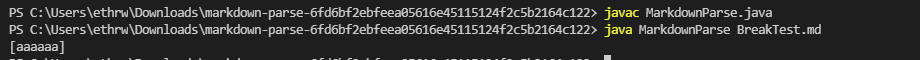

# Lab Report 2

## Context

During labs 3 & 4, my group and I worked on debugging a markdownParse file through creating failure-inducing tests and fixing the program to produce the correct outcome for those tests.  The following report will contain 3 sets of changes, the input that invoked those changes, the "symptom" that resulted from that input, and a short analysis.

## First Commit

### What Changed

the first commit was an implementation of breaks in the getLinks method that would trigger if the next character in the sequence was not in the file.



### Failure-inducing Input

The first failure-inducing input was a file that had a real link, and an open bracket near the end.



### Result of Running Before Fix

The program ran for almost a full minute before giving an Out Of Memory error on line 18 which meant the arguments being passed to substring were causing an error.



### What was Happening

The program would try to add the text between two parantheses even if it did not find them, so when the substring method was called, an infinite loop would occur ending with an OutOfMemory error.  The failure-inducing input made just that happen, and the fix was to make the loop break if any part of the link it was looking for was not there.

## Second Commit

### What Changed

the second commit was an added condition to the break for closeBracket so only situations where the close bracket and open parenthesis were next to eachother would count as links.



### Failure-inducing Input

The second failure-inducing input was the previous file, but with an almost-correct link format added afterward in that there were spaces between the close-bracket and the open parenthesis which markdown does not recognize as a link.



### Result of Running Before Fix

The program returned the string in the parenthesis along with the correct first link, which is the wrong output because the second element was not a link.



### What was Happening

The program did not exclude cases where the parenthesis and the brackets were separated, so if brackets were in one place and parentheses were in another, the program would still consider the text in the parentheses a link.  The failure-inducing input demonstrated that, and the fix was to check that the character after a close bracket was an open parenthesis and break if not.

## Third Commit

### What Changed

the second commit was an added condition to the break for openBracket so situations where there was an exclamation point directly before the open bracket were excluded. There was also still a bug that should have been addressed by commit 1 for a break if nextOpenBracket was -1 that was remedied here.



### Failure-inducing Input

The third failure-inducing input was a new file with an image because in markdown the format for a link is ```[]()``` while an image is `````` in which case, the text in the parentheses should not be returned as a link.



### Result of Running Before Fix

The program returned the string in the image's parenthesis, which is the wrong output because the writing in the image's parenthesis should not be added to the listas a link.



### What was Happening

Because the way to put an image in a markdown file has a single character difference from the way to insert a link, without a specific check for this case, the program would consider images links.  This was observed in the symptom output from a file with an image link. I fixed this by adding a break that occured when the character before the open parenthesis was an exclamation point.