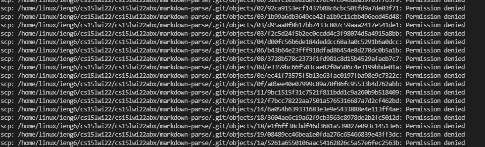
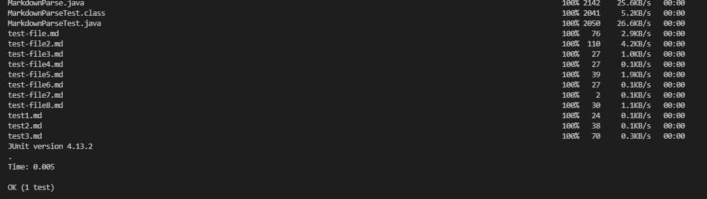

# Copying Whole Directories with ```scp -r```

In this lab report, I will be demonstrating how to move directories as a whole to a remote server.  This will be extremely helpful because it means we will not have to run dozens if not hundreds of scp commands, let alone creating new directories, to put a project on the server. We can do this with the ```-r``` extention.  For demonstration I will use my markdown-parse directory.

## copying whole directory into server

To copy a directory into the server, run 

  ```
    scp -r direcotoryPath accountName@serverName:~
  ```
  


## Junit Tests in Server

Now I will run the Junit test file that had one test in the server.  First I use ```ssh``` to get in and ```ls -lat``` to find the directory I just added. It looked like this:


Then to run the tests I had to first change directory to my added directory, then compile using the -cp extention of javac to use the Junit source files in lib when compiling.  The same had to be done when running.  Compiling and running Junit files in a lib directory will look like this:

```
  javac -cp .:lib/junit-4.13.2.jar:lib/hamcrest-core-1.3.jar fileName.java
  
  java -cp .:lib/junit-4.13.2.jar:lib/hamcrest-core-1.3.jar org.junit.runner.JUnitCore fileName"
```

The process looks like this, and if tests pass the output will give you an OK:


## All at Once

For the final part of this report, I will detail how to do this whole process and log out of the server in a single command in the terminal.  Using the semicolon, we can separate ```scp``` and ```ssh``` and use the semicolon within quotation marks to do multiple things in the server before logging out with the ```ssh``` command like this:

```
  scp -r something somewhere;ssh somewhere "doSomething;doSomethingElse"
```

Here I will send my markdown-parse directory and I will login, change directory to the one I made, compile the test file, and run the test file.  The command and output were as follows,







As you can see, this command put my directory into my server, compiled, and ran my program without me needing to type out more than the one command.  This is useful because As I work on that project, a single press of the up arrow and the enter key will do that whole process.  I can also save that command in a text file, or even a bash script for use in the future.  

Thank you for reading.