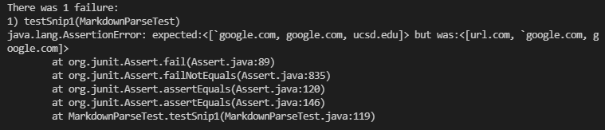
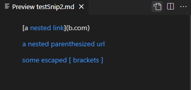
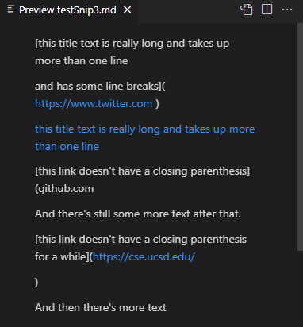
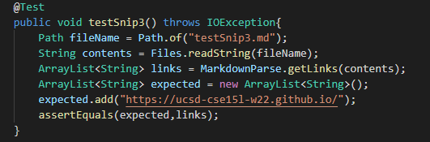

# Introduction

In this lab report, I will observe the output of my markdown-parse and one that I reviewed under certain cases and either provide a fix for each if the fix is trivial, or explain why the fix must be non-trivial.

## Repositories used

[here is a link to my repo](https://github.com/Wilbow86/markdown-parse)

[here is a link to the repo I reviewed](https://github.com/nseyoum/CSE15L-Platypus.git/)

## Snippet 1

### Expected output

according to the markdown preview in vsCode, the expected output should be links 2, 3, and 4.  (\`google.com, google.com, ucsd.edu) 

### Output of reviewed markdown-parse

the project I reviwed failed, showing the same symptom as my own, including the first link(url.com) and excluding the final(ucsd.edu).  

### Output of my markdown-parse

My markdown-parse fails to exclude the first link because there are no checks for backticks inside the brackets.  A three line fix for this is to make a string that is the substring of markdown between nextOpenBracket and nextCloseBracket, check if charAt(\`) !=-1 in an if statement on a second line, and set current index to nextCloseParen then continue if that was true.  My code also fails to include the fourth link because there is a second close bracket in it.  I could fix this in 4 or 5 lines by getting the next "](" after nextCloseBracket, checking if it is either -1 or > nextCloseParenth, set currentIndex to nextCloseParenth and continuing if true, and adding the substring between the two parenthesis to the list if false

## Snippet 2

### Expected output

according to the markdown preview in vsCode, the expected output should be the link inside brackets of the first link, as well as the other two blocks.  (a.com, a.com(()), example.com). 

### Output of reviewed markdown-parse

the project I reviwed only returned one of the three links, the one with nested parenths, but it did not return the close parenths, so that link was also not fully correct. 

### Output of my markdown-parse

My markdown-parse successfully adds the first link to the list, fails to get the close parentheses from the second link, and returns before reaching the third link.  I can fix the early break by changing my four return statements to only increment currentIndex and continue instead of break, probably only taking four lines.  Fixing the parenthesis problem would require me to count the open/close parenthesis in the substring that might be added in a while loop, changing what the substring is under circumstances where I need to add up to a further close parenth, and have conditions that determine whether to add or not to add the string in the end.  I believe this process would be non-trivial and would probably require more iteration after I do it just to make the code work again.

## Snippet 3

### Expected output

according to the markdown preview in vsCode, the only link that is actually part of link syntax is the second really long title containing a github link.  the other links that show up do not put the link in bracketed text, so they are not properly formatted. (https://ucsd-cse15l-w22.githum.io/). 

### Output of reviewed markdown-parse

the project I reviewed got the link correctly, but added a large portion of the file as a single link afterward (from the start of the link without a close parenth to the close parenth of the next link). 

### Output of my markdown-parse

My markdown-parse fils to exclude the twitter link because it does not check for new lines in links, correctly adds the github link that it is supposed to, and fails to exclude the rest of the file because the open parenth of the next link does not close until the end of the file.  To fix these issues, my code should check for a new line break in the bracketed text and exclude that link if there is one, and exclude a link if there is a new line character in the string to be added.  The latter condition could be checked and fixed in 2 lines, but the check to allow a new line, but not a break in the brackets may prove to take more than the remaining 8.  The best way to do it would probably be to make a string variable from the text in brackets and have a set of conditional statements to determine whether to allow the loop to go on or continue.
