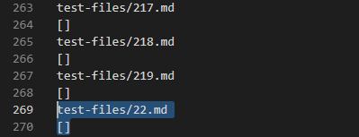

# Lab Report 5

In this lab report I will compare 2 examples of differences of the output of my markdown parse on a set of test files with the output of a version of markdown parse from lab 9. 

## Acquiring different results

To find which tests produced a different output between my implementation of markdownParse and the version from lab nine by using the ```diff``` command to give me the places where output was different, and directing the output of ```diff``` in a new text file called diffOutputs.  I then searched through the new file manually for the two example tests I will highlight for this report

## Test 1

One difference between the two programs' outputs ocurred at test 22.md.

### My output


### Lab 9 output



### Correct output

rendered in a preview, the file looks like this


The preview creates a link with the words foo, but the place the link tries to go is in /bar\*.  This means the output is expected to be ```[/bar\*]```, which neither program produces.

### Bug in lab9 markdown-parse that is causing this symptom

lab 9's markdown-parse excludes this link from the output because it excludes links that have spaces in them.  Specifically, if the text between parentheses has a space character or a new line, this program skips that and continues searching the file for a link.  Beyond that problem, the text after the space should be separate as it is not part of the link, but is part of the formatting that the parser should not care about.


## Test 2

Another difference between the two programs' outputs ocurred at test 201.md.

### My output


### Lab 9 output


### Correct output

rendered in a preview, the file looks like this


The preview creates no links, so the expected output is an empty list.  My parser produces this while the lab9 parser does not.

### Bug in lab9 markdown-parse that is causing this symptom

The lab9 markdown-parse does not exclude links where there is something between the end bracket and open parenthesis.  There would need to be a check for either exactly an open parenth after the close bracket, or any other syntax that is legal.


