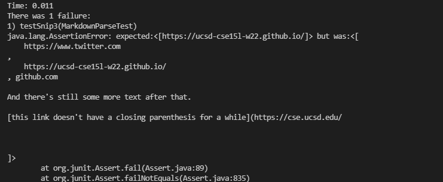

# Introduction

In this lab report, I will observe the output of my markdown-parse and one that I reviewed under certain cases and either provide a fix for each if the fix is trivial, or explain why the fix must be non-trivial.

## Snippet 1

### Expected output

according to the markdown preview in vsCode, the expected output should be links 2, 3, and 4.  (\`google.com, google.com, ucsd.edu) 

### Output of reviewed markdown-parse

the project I reviwed failed, showing the same symptom as my own, including the first link(url.com) and excluding the final(ucsd.edu).  Note: the tests shown in the reviewed sections are the same ones used for my tests, but because I am running my tests on ieng-6 and the reviewed ones locally, it is better to show the JUnit tests in the reviewed output section than in my output's section. 

### Output of my markdown-parse

My markdown-parse fails to exclude the first link because there are no checks for backticks inside the brackets.  A three line fix for this is to make a string that is the substring of markdown between nextOpenBracket and nextCloseBracket, check if charAt(\`) !=-1 in an if statement on a second line, and set current index to nextCloseParen then continue if that was true.  My code also fails to include the fourth link because there is a second close bracket in it.  I could fix this in 4 or 5 lines by getting the next "](" after nextCloseBracket, checking if it is either -1 or > nextCloseParenth, set currentIndex to nextCloseParenth and continuing if true, and adding the substring between the two parenthesis to the list if false

## Snippet 2

### Expected output

according to the markdown preview in vsCode, the expected output should be the link inside brackets of the first link, as well as the other two blocks.  (a.com, a.com(()), example.com). 

### Output of reviewed markdown-parse

the project I reviwed only returned one of the three links, the one with nested parenths, but it did not return the close parenths, so that link was also not fully correct. 

### Output of my markdown-parse

My markdown-parse fails to 

## Snippet 3

### Expected output

according to the markdown preview in vsCode, the only link that is actually part of link syntax is the second really long title containing a github link.  the other links that show up do not put the link in bracketed text, so they are not properly formatted. (https://ucsd-cse15l-w22.githum.io/). 

### Output of reviewed markdown-parse

the project I reviwed got the link correctly, but added a large portion of the file as a single link afterward (from the start of the link without a close parenth to the close parenth of the next link). 

### Output of my markdown-parse

My markdown-parse fails to 
